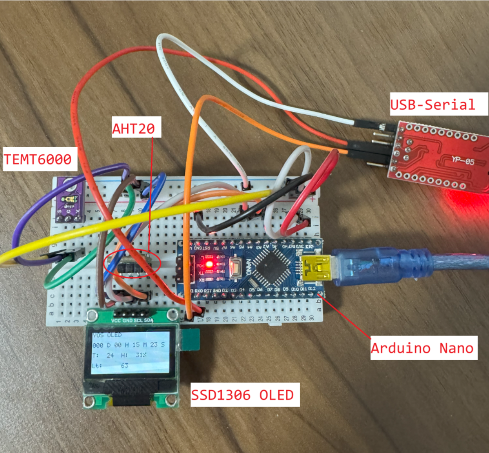
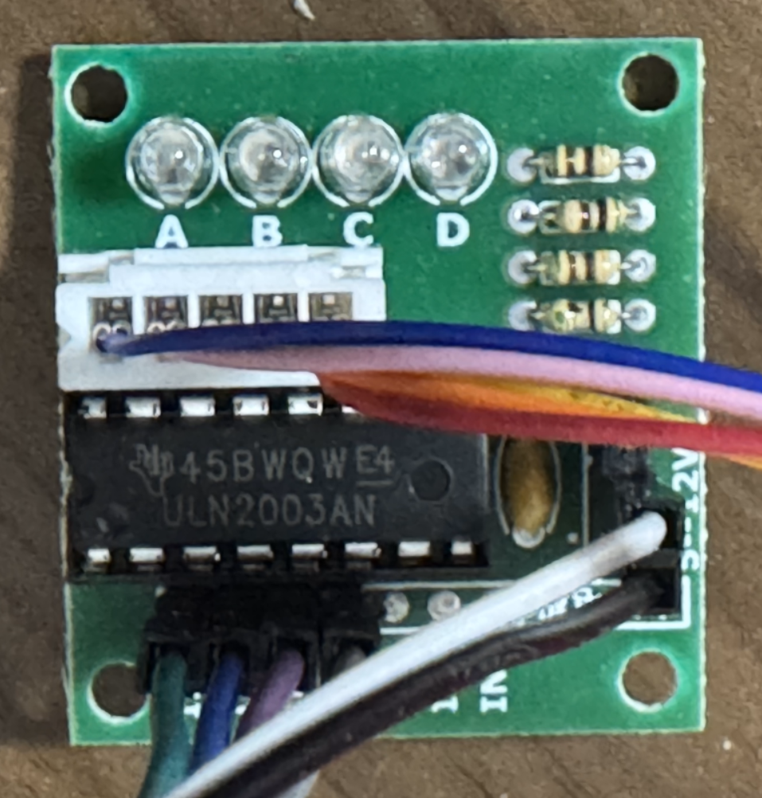

# YOS
Implement a simple OS which runs on ATmega328P for learning

ATmega328Pで動ける簡単なOSを実現してみます、勉強するためです

## Hardware
Arduino nano with ATmega328P MCU

ATmega328P MCUを搭載するArduino　NANO

### PIN Connection（PIN接続）
| ATmega328P PIN | Function（機能） | Connect to Device（接続先） | PIN of connected device（接続先PIN） |
| --- | --- | --- | --- |
| D0/RX | UART Receive  | Serial/USB-Serial module | TX |
| D1/TX | UART Transmit | Serial/USB-Serial module | RX |
| AREF | ADC Ref | the same ATmega328P | 3v3 |
| A2 | ADC[2] | Temt6000 | S |
| A4 | IIC SDA | SSD1306 | SDA |
|  |  | AHT20 | SDA |
| A5 | IIC SCL | SSD1306 | SCL |
|  |  | AHT20 | SCL |
| D4 | Digital Output | Motor Driver Board (with ULN2003) | IN4 |
| D5 | Digital Output | Motor Driver Board (with ULN2003) | IN3 |
| D6 | Digital Output | Motor Driver Board (with ULN2003) | IN2 |
| D7 | Digital Output | Motor Driver Board (with ULN2003) | IN1 |

#### Image: Atmega328P

#### Image: Motor Driver Board

### ATmega328P
- 16 MHz CPU
- 2 KB SRAM
- 32 KB Flash(30 KB available)
- 1 KB EEPROM

## Development Environment （開発環境）
- VS Code with PlatformIO extension
- toolchain-atmelavr @ 1.70300.191015 (7.3.0)

# Features
## Core
- Up to 8 tasks

  最大8個タスク

- Scheduling by time slice

  タイムスライスでスゲージュリング

- delay/msleep/schedule functions to give up current running chance

  delay/msleep/schedule関数で自発的にスゲジュウルします

- Mutex

  Mutex

- User Timer ( *** not tested yet *** )

  ユーザー用タイマー　（*** 動作確認はまだです ***）

## Hardware Interface Driver（ハードウェア　インタフェース　ドライバー）
- ADC
- IIC
- USART

## Others（その他）
- A cmdline interface

  コマンドライン

- SSD1306 oled (3rd library used)

  SSD1306 OLED（第三者ライブラリ利用）

- AHT20 Temperature & Humidity Sensor (3rd library used)

  AHT20温湿度センサー（第三者ライブラリ利用）

- TEMT6000 Light Sensor

  TEMT6000明るさセンサー

- 28BYJ-48 Step Motor(Driver Board with ULN2003)

  28BYJ-48 ステップモーター（ULN2003のドライバーICを利用します）

# How to use（使い方）
It is quite easy to use YOS, maybe it will be faster to go and have a look at main()

YOSは使いやすいと思います、main()関数を見ていただければすぐ分かるようになりますでしょう

The main() does some initializations like USART, IIC, ADC firstly.

main()関数は最初にいくつかの初期化処理を行います、例えばUSART、IIC、ADCなど。

And then call yos_init() to initialize the YOS.

そしてyos_init()を呼び出して、YOSの初期化します。

After that, some tasks are created with yos_create_task function.

次に、yos_create_task関数を呼び出して、いくつかのタスクを作成します。

At last, yos_start() is called and tasks created are scheduled to run.

最後に、yos_start()を呼び出してから、YOSを動かせて、さっき作成されたタスクはそれぞれスゲージュルされて動くようになります

	int main()
	{
		if (basic_io_init(yusart_io_operations) != 0) {
			return -1;
		}

		if (user_timer_init() != 0) {
			return -1;
		}

		if (yiic_master_init(YIIC_MASTER_SPEED) != 0) {
			return -1;
		}

		if (yadc_init() != 0) {
			return -1;
		}

		_BASIC_IO_WRITE("-------------\n");
		_BASIC_IO_WRITE("YOS starts\n");

		yos_init();

		if (yos_create_task(_cmdline_task, NULL, 250, "cmdtask") < 0) {
			return -1;
		}

		if (yos_create_task(_oled_task, NULL, 180, "oledtsk") < 0 ) {
			return -1;
		}

		if (yos_create_task(_aht20_task, NULL, 100, "ahttsk") < 0 ) {
			return -1;
		}

		if (yos_create_task(_temt6000_task, NULL, 100, "temttsk") < 0 ) {
			return -1;
		}

		yos_start();

		/*
		 * Not going here
		 *
		 * ここに着くことはありません
		 */
		return 0;
	}

And you can find each task functions which are as below:

タスク関数は全部下記のような形となります：

	int _XXX_task(void *para)
	{
		/* Do prepare work first */
		_XXX_prepare_work_1();
		......
		_XXX_prepare_work_N();

		while (1) {
			/* Do work repeatedly */
			_XXX_do_work_1();
			......
			_XXX_do_work_M();

			/* Sleep some time for the next loop */
			yos_task_msleep(1000);
		}

		return 0;
	}

## About cmdline（cmdlineについて）
USART settings are like below:

- Baudrate: 250000 8N1
- Flow control: None
- Newline character（改行コード）: LF

Right now the following commands are available:

いまは下記のコマンドが利用できます：
- help

	Show all the available commands

	全部利用できるコマンドを表示します

- echo

	Echo the input as argument arrays(i.e. argc and argv)

	入力された内容をアーギュメント配列として表示します（あるいはargc、argvの形で）

- si

	Display some system info

	いくつかのシステム情報を表示します

- sleep

	Sleep for given time(ms)

	指定する時間（ミリ秒）で待ち合わせます

- sm

	Rotate Step Motor with specified [Direction] and [Pulse-sets Number]

	方向とパルスセット数を指定してモーターを回転させる

- ts

	Show task status

	タスク情報を表示します

	ID: Task ID（タスクID）

	ST: Task status（タスク状態）

	SS: Stack size（スタックサイズ）

	MSS: Max size used in stack by now（今までスタックを利用している最大サイズ）

	NAME: Task name（タスク名）

- exit

	Exit command line

	コマンドを終了します

Example（例）:

		ATmega328p> help
		            help
		            echo
		              si
		           sleep
		              sm
		              ts
		            exit
		ATmega328p> echo hello yos world!
		[ 0]    [echo]
		[ 1]    [hello]
		[ 2]    [yos]
		[ 3]    [world!]
		ATmega328p> echo "hello yos world!"
		[ 0]    [echo]
		[ 1]    [hello yos world!]
		ATmega328p> si
		MCU: ATmega328P 16MHz
		Flash: 30KB
		RAM: 2KB
		sz char=1
		sz short=2
		sz int=2
		sz long=4
		sz float=4
		sz double=4
		sz void *=2
		ATmega328p> sleep 5000
		sleep 5000 ms
		5000 ms slept
		ATmega328p> sm 0 20
		ATmega328p> sm 1 20
		ATmega328p> ts
		ID    ST      SS     MSS    NAME
		000    1      50      47    yosidle
		001    1     250     208    cmdtask
		002    2     180     153    oledtsk
		003    2     100      65    ahttsk
		004    2     100      49    temttsk
		ATmega328p>

# About OLED（OLEDについて）
The following infomations are displayed on OLED:

OLEDで下記の情報が表示されます

- YOS OLED
- UP Time

  起動してから経った時間

- Temperature and humidity

  温湿度
- Light(just the ADC result)

  明るさ（ADC変換した結果そのまま）

The OLED inverses display every minute.

OLEDの表示は「分（60秒）」毎で色反転になります

# Thanks（感謝）
The following 3rd libraries are used and let me thanks the authors.

下記の第三者ライブラリを利用しています、著作者方々に感謝の意を表させてください。

- For AHT20

is under the folder [lib/AVR_aht20]

フォルダ[lib/AVR_aht20]に格納します

https://github.com/kpierzynski/AVR_aht20

- For SSD1306 OLED

is under the folder [lib/ssd1306xled]

フォルダ[lib/ssd1306xled]に格納します

https://github.com/tinusaur/ssd1306xled

## About modifications（ソース修正について）
It seems that it is difficult to exclude source files of a 3rd-library from building with PlatformIO, and some source files make building errors.

I changed the file name with a suffix of [.org]

PlatformIOを利用していますが、第三者ライブラリの中に指定するソースファイルだけをビルド対象にするのは難しそうです。いくつかのソースファイルのビルドにエラーが出ました。

それらのソースファイル名に「.org」をつけて変更させていただきました。

And to make it better to do with YOS, some source files are modified and some new source files are added.

いくつかの新規ソースファイルも追加させていただきました、YOSの動けるようにするためです。

# Copyright & License
MIT License

Copyright (c) 2025 Ashibananon(Yuan)
